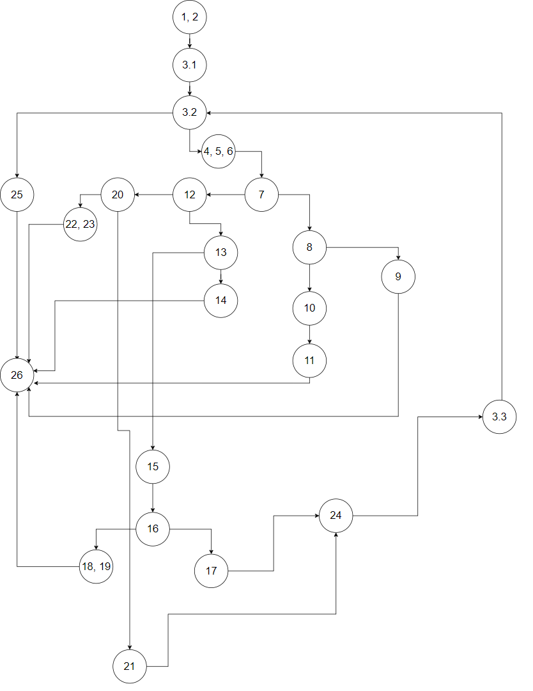
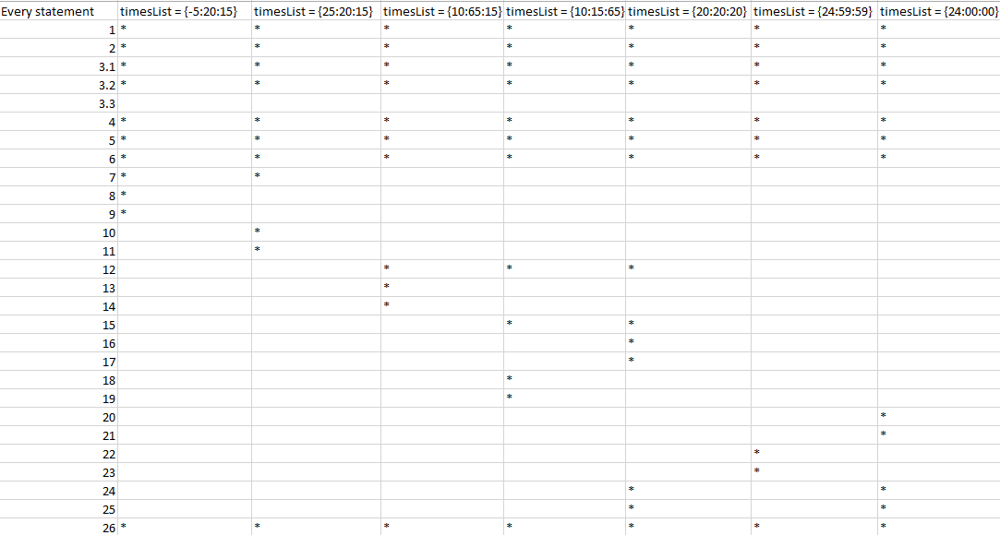

# Втора лабораториска вежба по Софтверско инженерство

## Теодора Дојчиноска, бр. на индекс 196003

### Control Flow Graph

### Цикломатска комплексност
Цикломатската комплесност е 8 така што има 29 ребра и 23 предикатни јазли. Па затоа 29 - 23 = 6 -> 6 + 2 = 8

### Тест случаи според критериумот Every statement

-5:20:15

25:20:15

10:65:15

10:15:65

20:20:20

24:59:59

24:00:00

### Тест случаи според критериумот Every path

      1,2 -> 3.1 -> 3.2 -> 4,5,6 -> 7 -> 8 -> 9 -> 26  // -5:20:15

      1,2 -> 3.1 -> 3.2 -> 4,5,6 -> 7 -> 8 -> 10 -> 11 -> 26 // 25:20:15

      1,2 -> 3.1 -> 3.2 -> 4,5,6 -> 7 -> 12 -> 13 -> 15 -> 16 -> 18,19 -> 26  // 10:65:15

      1,2 -> 3.1 -> 3.2 -> 4,5,6 -> 7 -> 12 -> 13 -> 15 -> 16 -> 18,19 -> 26  // 10:15:65

      1,2 -> 3.1 -> 3.2 -> 4,5,6 -> 7 -> 12 -> 13 -> 15 -> 16 -> 17 -> 24 -> 3.3 -> 3.2 -> 25 -> 26  // 20:20:20

      1,2 -> 3.1 -> 3.2 -> 4,5,6 -> 7 -> 12 -> 20 -> 21 -> 22,23 -> 26  // 24:59:59

      1,2 -> 3.1 -> 3.2 -> 4,5,6 -> 7 -> 12 -> 20 -> 21 -> 24 -> 3.3 -> 3.2 -> 25 -> 26  // 24:00:00

### Објаснување на напишаните unit tests

За Every statement ги проверував и ги поминуваат сите statements и некои се со exceptions па затоа во кодот ги направив со try catch блок а некои се само со assertEquals
За Every path ги проверив и ги поминав сите paths и исто така повеќето се со excepotions а 2 со Equals
